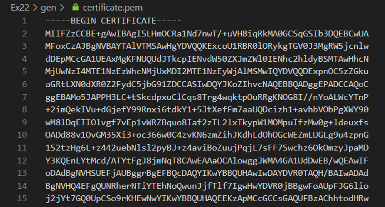
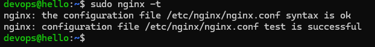
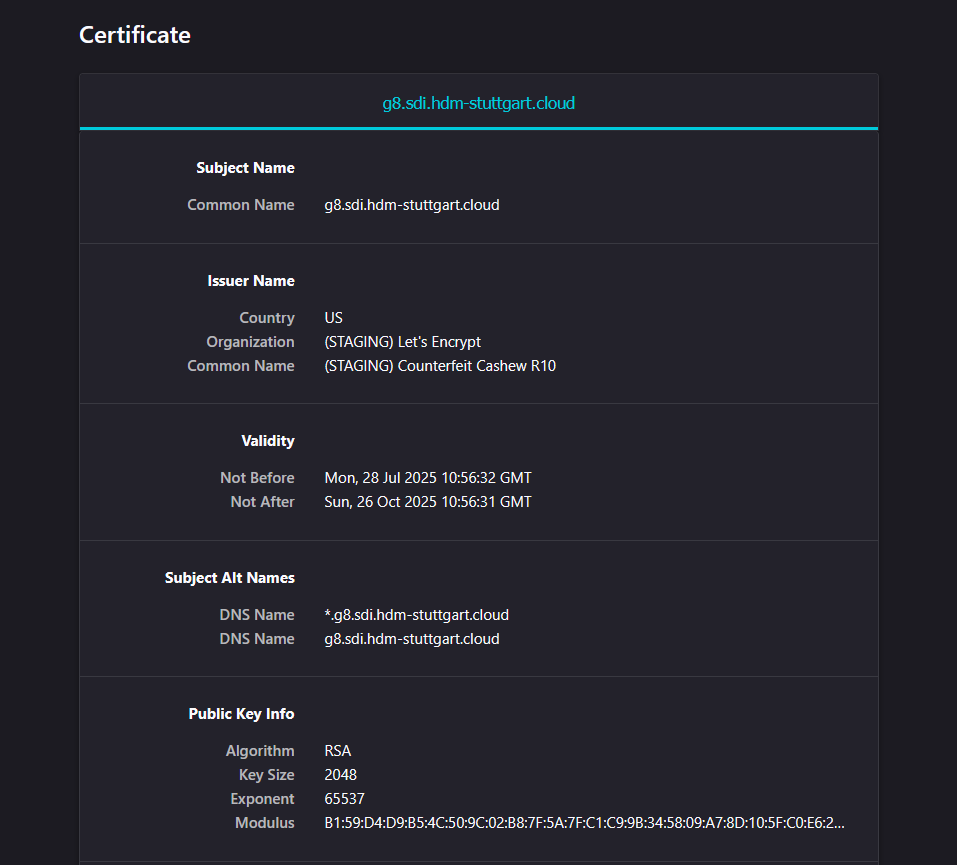

## Why do websites need an SSL certificate?

A website needs an SSL certificate in order to keep user data secure, verify ownership of the website, prevent attackers from creating a fake version of the site, and gain user trust.

Encryption: SSL/TLS encryption is possible because of the public-private key pairing that SSL certificates facilitate. Clients (such as web browsers) get the public key necessary to open a TLS connection from a server's SSL certificate.

Authentication: SSL certificates verify that a client is talking to the correct server that actually owns the domain. This helps prevent domain spoofing and other kinds of attacks.

HTTPS: Most crucially for businesses, an SSL certificate is necessary for an HTTPS web address. HTTPS is the secure form of HTTP, and HTTPS websites are websites that have their traffic encrypted by SSL/TLS. - [Certificates](https://www.cloudflare.com/learning/ssl/what-is-an-ssl-certificate/)

### Creating a web TLS/SSL certificate

#### Define required providers

First, declare the providers needed in your `terraform` block:

- The Hetzner Cloud provider (`hcloud`) — useful if you manage infrastructure on Hetzner.
- The ACME provider (`acme`) for certificate management via Let’s Encrypt.

```
terraform {
  required_providers {
    hcloud = {
      source = "hetznercloud/hcloud"
    }
    acme = {
      source  = "vancluever/acme"
    }
  }
  required_version = ">= 0.13"
}
```

#### Configure the ACME provider

Set the ACME server URL. Here you’re using `Let’s Encrypt’s` staging environment, which is good for testing and avoids hitting rate limits.

```
provider "acme" {
  server_url = "https://acme-staging-v02.api.letsencrypt.org/directory"
}
```

#### Generate private keys

You generate two private keys with the `tls_private_key` resource:

- An ED25519 SSH key (optional, can be used elsewhere)
- An RSA key used as your account key and certificate key for ACME

```
resource "tls_private_key" "ssh_key" {
  algorithm = "ED25519"
}

resource "tls_private_key" "cert_key" {
  algorithm = "RSA"
}
```

#### Save keys and certificates locally

Use `local_file` resources to save:

- The private RSA key (`private.pem`)
- The issued certificate (`certificate.pem`)

These will be saved into a `./gen` directory on your local machine.

```
resource "local_file" "private_key" {
  content  = tls_private_key.cert_key.private_key_pem
  filename = "./gen/private.pem"
}

resource "local_file" "certificate" {
  content  = acme_certificate.certificate.certificate_pem
  filename = "./gen/certificate.pem"
}
```

#### Register ACME account

Register an ACME account using the RSA private key, and specify your email address (for expiration notifications).

```
resource "acme_registration" "reg" {
  account_key_pem = tls_private_key.cert_key.private_key_pem
  email_address   = "nobody@examples.com"
}
```

Replace `"nobody@examples.com"` with your actual email.

#### Request Certificate with DNS Challenge

Create an ACME certificate resource:

- The common name is your main domain (`var.dnsZone`).
- The subject alternative name includes a wildcard for all subdomains (`*.yourdomain.com`).

You should use a DNS challenge for domain validation via RFC 2136 dynamic DNS updates, configured with:

- Your DNS server address (`ns1.sdi.hdm-stuttgart.cloud`)
- TSIG key info (`key`, `algorithm`, `secret`)

```
resource "acme_certificate" "certificate" {
  account_key_pem           = acme_registration.reg.account_key_pem
  common_name               = var.dnsZone
  subject_alternative_names = [ "*.${var.dnsZone}"]

  dns_challenge {
    provider = "rfc2136"

    config = {
      RFC2136_NAMESERVER     = "ns1.sdi.hdm-stuttgart.cloud"
      RFC2136_TSIG_ALGORITHM = "hmac-sha512"
      RFC2136_TSIG_KEY       = "g8.key."
      RFC2136_TSIG_SECRET    = file("../dns_secret.key")
    }
  }
}
```

After running terraform apply, a file named certificate.pem should be created in the gen directory containing the certificate data.



### Automating SSL certificate creation

#### Define required providers

Start by declaring the necessary providers in your terraform block:

- Add DNS (`hashicorp/dns`) for handling DNS records.

```
 terraform {
  required_providers {
    hcloud = {
      source = "hetznercloud/hcloud"
    }
    dns = {
      source = "hashicorp/dns"
    }
    acme = {
      source  = "vancluever/acme"
    }
  }
  required_version = ">= 0.13"
}
```

#### Configure the DNS provider

To validate ownership of the domain via DNS challenge, configure the `dns` provider with the same settings you use for dynamic updates:

```
provider "dns" {
  update {
    server        = "ns1.sdi.hdm-stuttgart.cloud"
    key_name      = "g8.key."
    key_algorithm = "hmac-sha512"
    key_secret    = file("../dns_secret.key")
  }
}
```

#### Create DNS records for the domain

Define the necessary A records for both the apex domain and subdomains:

- The apex record (`example.com`) points to your Hetzner server's IPv4-address.
- The subdomain records (e.g., `www`, `api`, etc.) are generated dynamically based on the `serverNames`list.

```
resource "dns_a_record_set" "apex" {
  zone      = "${var.dnsZone}."
  addresses = [hcloud_server.helloServer.ipv4_address]
  ttl       = 10
}

resource "dns_a_record_set" "subdomains" {
  count     = length(distinct(var.serverNames))
  zone      = "${var.dnsZone}."
  name      = var.serverNames[count.index]
  addresses = [hcloud_server.helloServer.ipv4_address]
  ttl       = 10
}
```

#### Generate TLS private keys

You need two private keys:

- One for the ACME account registration
- One for the SSL certificate itself

```
resource "tls_private_key" "cert_key" {
  algorithm = "RSA"
}

resource "tls_private_key" "account_key" {
  algorithm = "RSA"
}
```

These keys are generated using the tls provider.

#### Register with the ACME server

Register a new ACME account using your email and account key. This is required before requesting a certificate.

```
resource "acme_registration" "reg" {
  account_key_pem = tls_private_key.account_key.private_key_pem
  email_address   = "nobody@examples.com"
}
```

#### Create a certificate signing request (CSR)

Use the certificate private key to create a CSR with a wildcard DNS name (e.g., \*.example.com).

resource "tls_cert_request" "cert_req" {
private_key_pem = tls_private_key.cert_key.private_key_pem

```
  subject {
    common_name = var.dnsZone
  }

  dns_names = ["*.${var.dnsZone}"]
}
```

#### Request the certificate via DNS challenge

Now you can request the certificate from the ACME server using DNS-01 challenge. This verifies ownership of your domain using temporary DNS records.

```
resource "acme_certificate" "certificate" {
  account_key_pem         = acme_registration.reg.account_key_pem
  certificate_request_pem = tls_cert_request.cert_req.cert_request_pem

  dns_challenge {
    provider = "rfc2136"
    config = {
      RFC2136_NAMESERVER     = "ns1.sdi.hdm-stuttgart.cloud"
      RFC2136_TSIG_ALGORITHM = "hmac-sha512"
      RFC2136_TSIG_KEY       = "g8.key."
      RFC2136_TSIG_SECRET    = file("../dns_secret.key")
    }
  }
}
```

#### Generate cloud-init file with keys and certificate

A `local_file` resource is used to generate a `userData.yml` file (for example, as cloud-init input). This file includes:

- SSH host keys
- Your ACME certificate and private key
- The username for remote access

```
resource "local_file" "user_data" {
  content = templatefile("tpl/userData.yml", {
    host_ed25519_private = indent(4, tls_private_key.ssh_key.private_key_openssh)
    host_ed25519_public  = indent(4, tls_private_key.ssh_key.public_key_openssh)
    devopsUsername       = hcloud_ssh_key.loginUser.name
    private_key_pem      = indent(6, tls_private_key.cert_key.private_key_pem)
    certificate_pem      = indent(6, acme_certificate.certificate.certificate_pem)
  })
  filename = "gen/userData.yml"
}
```

#### Use the Certificate in Nginx

Once the certificate is issued, you can configure Nginx to use it:

```
- path: /etc/nginx/sites-available/default
  content: |
    server {
        listen 443 ssl;
        server_name _;
        ssl_certificate     /etc/ssl/certs/certificate.pem;
        ssl_certificate_key /etc/ssl/private/private.pem;
        location / {
            root /var/www/html;
            index index.html;
        }
    }

- path: /etc/ssl/certs/certificate.pem
  permissions: '0644'
  owner: root:root
  content: |
    ${certificate_pem}

- path: /etc/ssl/private/private.pem
  permissions: '0600'
  owner: root:root
  content: |
    ${private_key_pem}
```

You can inject this config into a cloud-init or system provisioning process.

You should review the `runcmd` section, as an incorrect execution order could potentially lead to errors:

```
runcmd:
  - apt update && apt -y upgrade
  - systemctl enable nginx
  - echo "I'm Nginx @ $(dig -4 TXT +short o-o.myaddr.l.google.com @ns1.     google.com) created $(date -u)" > /var/www/html/index.html
  - systemctl restart nginx
  - systemctl restart sshd
  - systemctl enable fail2ban
  - systemctl restart fail2ban
  - updatedb
```

Use `nginx -t` to test the Nginx configuration for syntax errors



If `nginx -t` completes successfully, you can open the URLs in your browser and inspect the generated certificate.


