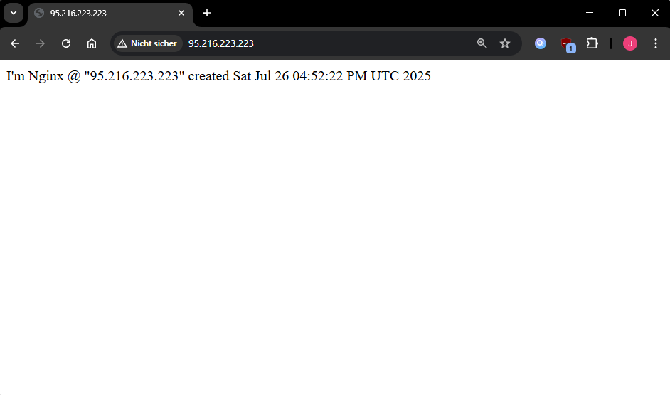
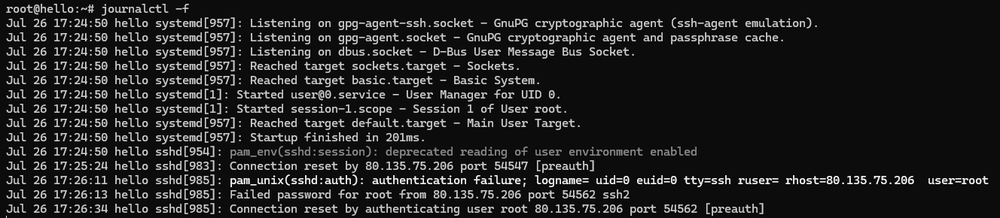
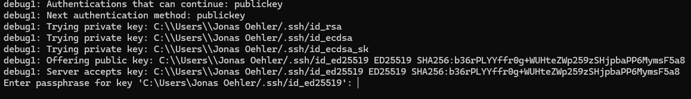
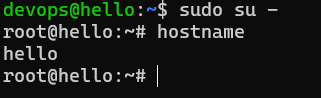
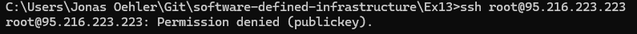
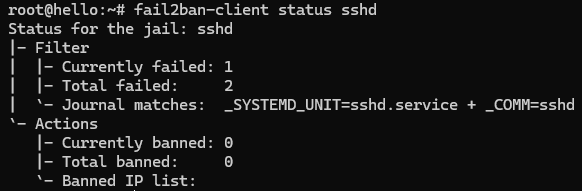
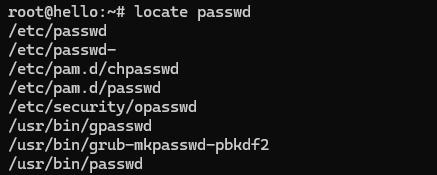

## What is cloud-init

Cloud-init is the industry standard multi-distribution method for cross-platform cloud instance initialization. It is supported across all major public cloud providers, provisioning systems for private cloud infrastructure, and bare-metal installations.

During boot, cloud-init identifies the cloud it is running on and initializes the system accordingly. Cloud instances will automatically be provisioned during first boot with networking, storage, SSH keys, packages and various other system aspects already configured. - [Cloud-init](https://cloudinit.readthedocs.io/en/latest/)

### Configuration options

The primary configuration file for Cloud-init is typically a YAML file called `user-data`. Key features and options available in Cloud-init include:

- File management: Create, read, update, and delete files as needed.
- SSH configuration: Use SSH keys for secure access and disable password-based SSH login entirely.
- User management: Add new users or modify existing ones.
- Package installation: Specify packages to be installed automatically, such as Nginx.
- System upgrade and reboot: Configure Cloud-init to perform system upgrades and reboot the server if necessary.
- Custom commands: Define arbitrary commands to be executed during the boot process.

### Basic web server configuration

You can attach your Cloud-init configuration file to a server in Terraform by using the `user_data` parameter:

```
resource "hcloud_server" "helloServer" {
  name         = "hello"
  ...
  user_data = file("userData.yml")
}
```

Here’s a simple example of a `userData.yml` file for this scenario:

```
#cloud-config
packages:
 - nginx
runcmd:
 - systemctl enable nginx
 - rm /var/www/html/*
 - >
 echo "I'm Nginx @ $(dig -4 TXT +short o-o.myaddr.l.google.com
@ns1.google.com)
 created $(date -u)" >> /var/www/html/index.html
```

In this setup, the Nginx package is installed and configured to start automatically at boot. The web directory is cleared, and a simple HTML page is created at `/var/www/html/index.html` displaying the server’s IP-address and its creation time.

To allow access to the web server, you need to update your firewall settings to permit incoming traffic on port 80.

```
resource "hcloud_firewall" "sshFw" {
 name = "my-firewall"
 rule {
   direction = "in"
   protocol  = "tcp"
   port      = "22"
   source_ips = [
     "0.0.0.0/0",
     "::/0"
   ]
 }
 rule {
   direction = "in"
   protocol = "tcp"
   port = "80"
   source_ips = [
     "0.0.0.0/0",
     "::/0"
   ]
 }
}
```

You can then access your web server by navigating to `http://<server-ip>` in your browser.



### Using template files with cloud-init

Terraform’s `templatefile` function can be combined with Cloud-init to dynamically create configuration files. This allows customization based on variables or other runtime inputs.

In `main.tf`:

```
resource "local_file" "user_data" {
  content         = templatefile("tpl/userData.yml", {
    devopsUsername = hcloud_ssh_key.loginUser.name
  })
  filename        = "gen/userData.yml"
}

resource "hcloud_server" "helloServer" {
 ...
 user_data = local_file.user_data.content
}
```

In `tpl/userData.yml`:

```
...
users:
  - name: ${devopsUsername}
    groups: sudo
    ...
```

`gen/userData.yml` is automatically created when `terraform apply` is executed.

```
...
users:
 - name: devops
   groups: sudo
 ...
```

In this example, the `loginUser` variable is set dynamically within the Cloud-init configuration, enabling the creation of the user `devops`.

### Improving server security

To monitor your server in real time, run the command `journalctl -f` and observe the output:



What you're seeing are numerous unauthorized attempts to access your server via SSH, some using nonexistent usernames, others trying to log in as root. This indicates that your server is being targeted by automated SSH login attacks. To reduce the risk, you should:

- Disable SSH password authentication and completely prevent root login.
- Create a `devops` user with SSH access and permission to execute commands using `sudo`.

The `userData.yml` file defines the `devops` user and grants them passwordless sudo privilege:

```
users:
  - name: ${devopsUsername}
    ssh-authorized-keys:
      - ssh-ed25519
    sudo: ['ALL=(ALL) NOPASSWD:ALL']
    groups: sudo
    shell: /bin/bash
```

We update the `sshd_config` file with the following settings:

```
write_files:
 - path: /etc/ssh/sshd_config
   content: |
     Port 22
     PermitRootLogin no
     AllowUsers devops
     PasswordAuthentication no
     ...
```

This configuration disables SSH password authentication, prohibits root login, and permits access only for the user "devops". Although restricting access to "devops" alone makes `PermitRootLogin no` unnecessary, a bit of redundancy can be beneficial.

When you run the command `ssh -v devops@<server-ip>`, you should notice that password authentication is no longer offered as a valid method.



The user "devops" should also have permission to run sudo commands without being prompted for a password.



Finally, SSH login as root must be disabled:



### Automatic package updates

The operating system image provided by your cloud provider is not automatically upgraded during installation. To ensure the system is up to date, you can automate the update process as part of the server’s initial setup.

To do this, add the following to your `userData.yml file`:

```
package_update: true
package_upgrade: true
package_reboot_if_required: true
```

This makes sure your system is fully updated when created.

### Fail2Ban

Fail2ban is a security tool that helps protect your server against brute force attacks. You can automate its installation and setup using Cloud-init.

In your `userData.yml`, include `fail2ban` and `python3-systemd` in the list of packages to be installed. Then, add commands to enable and start Fail2ban automatically under the `runcmd` section.

```
packages:
- fail2ban
- python3-systemd
  ...
  runcmd:
  ...
- systemctl enable fail2ban
- systemctl start fail2ban

```

To set it up, edit the file `/etc/fail2ban/jail.local`:

```
 - path: /etc/fail2ban/jail.conf
    content: |
      [sshd]
      backend=systemd
      enabled = true
      port = 22
      filter = sshd
      logpath = /var/log/auth.log
      maxretry = 5
      bantime = 3600
      findtime = 600
```

This configuration causes Fail2Ban to ban IP-addresses after 5 unsuccessful login attempts.
To check the status of Fail2Ban for the sshd service, run:
`fail2ban-client status sshd`



### Plocate

`plocate` is a file search tool that enables fast file locating by using a pre-built index. To install and set it up, include it in the package list within `userData.yml` and configure the database generation under `runcmd`:

```
packages:
- plocate
  ...
  runcmd:
  ...
- sudo updatedb
```

We can now use the `locate` command to find files on our system, for example: `locate ssh_host`.



### Solving the known_hosts quirk

If you frequently recreate the server, for example by running `terraform apply`, you may encounter SSH warnings about the server’s fingerprint changing in the `known_hosts` file. To handle this automatically, you can use Cloud-init to manage the `known_hosts` entries.


#### Creating known_hosts entries

Start by creating a `tls_private_key` resource to generate an SSH key pair.
Add the following to your `main.tf` file:

```
resource "tls_private_key" "host" {
 algorithm = "ED25519"
}
```

If you haven’t done so yet, this is a good point to convert your `userData.yml` into a template. This way, the actual `userData.yml` file will be dynamically generated during `terraform apply`.
Place your template file inside a `tpl` directory. Inside the file, include the following content:

```
ssh_keys:
  ed25519_private: |
    ${host_ed25519_private}
  ed25519_public: |
    ${host_ed25519_public}
```

In your `main.tf`, ensure you have a `local_file` resource for `userData.yml` (if not already created), and make sure to pass the values for the `serverPublicKey` and `serverPrivateKey` variables.

```
resource "local_file" "user_data" {
  content         = templatefile("tpl/userData.yml", {
    host_ed25519_private = indent(4, tls_private_key.host.private_key_openssh)
    host_ed25519_public  = indent(4, tls_private_key.host.public_key_openssh)
    devopsUsername = hcloud_ssh_key.loginUser.name
  })
  filename        = "gen/userData.yml"
}
```

Ensure your server resource is updated accordingly.

```
resource "hcloud_server" "helloServer" {
 ...
 user_data = local_file.user_data.content
}
```

Next, you need to generate a `known_hosts` file that will be used when connecting to your server. To do this, add the following to your `main.tf`:

```
resource "local_file" "known_hosts" {
  content         = "${hcloud_server.helloServer.ipv4_address} ${tls_private_key.host.public_key_openssh}"
  filename        = "gen/known_hosts"
  file_permission = "644"
}
```

#### Template file (tpl/ssh.sh)

The template file makes sure that SSH connections use the correct `known_hosts` file (the one you generated).
To achieve this, create a template script named `ssh.sh` inside your `tpl` directory:

```
#!/usr/bin/env bash

GEN_DIR=$(dirname "$0")/../gen

ssh -o UserKnownHostsFile=
  "$GEN_DIR/known_hosts" devops@"${ip}" "$@"
```

This first locates the "gen" directory, then establishes the SSH connection using the custom `known_hosts` file stored there, as specified in the previous step.

#### Creating bin/ssh wrapper

Using the `ssh.sh` template file, generate an executable SSH script that you can run to connect to your server. To do this, add the following to your `main.tf` file:

```
resource "local_file" "ssh_script" {
  content = templatefile("tpl/ssh.sh", {
    devopsUsername = hcloud_ssh_key.loginUser.name
    ip = hcloud_server.helloServer.ipv4_address
  })
  filename        = "bin/ssh"
  file_permission = "755"
  depends_on      = [local_file.known_hosts]
}

```

Instead of typing ssh `devops@<server-ip>`, you can now simply run the `bin/ssh` wrapper:

```
path/to/bin/ssh
```

Thanks to the template file, all necessary variables, such as your server’s IP-address, are automatically included in the command executed by `bin/ssh`. Plus, and most importantly, this eliminates the annoying `known_hosts` warnings that you would otherwise have to handle manually.

#### Template file (tpl/scp.sh)

Likewise you can create a `scp.sh` template file for transfering files.
To achieve this, create a template script named `scp.sh` inside your `tpl` directory like we did for the `ssh.sh` script:

```
#!/usr/bin/env bash

GEN_DIR=$(dirname "$0")/../gen

if [ $# -lt 2 ]; then
   echo usage: .../bin/scp ... ${devopsUsername}@${ip} ...
else
   scp -o UserKnownHostsFile="$GEN_DIR/known_hosts" $@
fi
```

Since copying files requires a source and destination the `scp.sh` script checks for two extra user supplied values with `if [ $# -lt 2 ]`.

#### Creating bin/scp wrapper

Now you need to add a `locale_file` resource to our `main.tf` to generate our new script with the replaced values:

```
resource "local_file" "scp_script" {
  content = templatefile("tpl/scp.sh", {
    devopsUsername = hcloud_ssh_key.loginUser.name
    ip = hcloud_server.helloServer.ipv4_address
  })
  filename        = "bin/scp"
  file_permission = "755"
  depends_on      = [local_file.known_hosts]
}

```

You can run the `bin/scp` wrapper with:

```
path/to/bin/scp <source> <username>@<ip>:<destination>
```