## What is DNS

The Domain Name System (DNS) is the phonebook of the Internet. Humans access information online through domain names, like nytimes.com or espn.com. Web browsers interact through Internet Protocol (IP) addresses. DNS translates domain names to IP-addresses so browsers can load Internet resources.

Each device connected to the Internet has a unique IP-address which other machines use to find the device. DNS servers eliminate the need for humans to memorize IP-addresses such as 192.168.1.1 (in IPv4), or more complex newer alphanumeric IP-addresses such as 2400:cb00:2048:1::c629:d7a2 (in IPv6). - [DNS](https://www.cloudflare.com/learning/dns/what-is-dns/)

### Group-based subdomain assignment

- `Dedicated DNS Server`: All DNS records will be managed through ns1.sdi.hdm-stuttgart.cloud
- `Subdomain`: Each group is assigned a unique subdomain. For example, Group 8 will use g8.sdi.hdm-stuttgart.cloud.
- `Zone Editing`: To modify your DNS zone, you’ll need an HMAC secret key specific to your subdomain. This key is available in your group’s entry of the moodle course
- `Time to Live (TTL)`: A higher TTL value means DNS changes will take longer to propagate globally.

### DNS zone transfer

Note: For the following commands, you can either replace $HMAC directly with your HMAC key or export it as an environment variable using:
`export HMAC=hmac-sha512:g8.key:...`

To query your DNS configuration via a zone transfer, run the following command:
`dig @ns1.sdi.hdm-stuttgart.cloud -y $HMAC -t AXFR g8.sdi.hdm-stuttgart.cloud`

Be sure to use your group’s specific subdomain in place of g8.

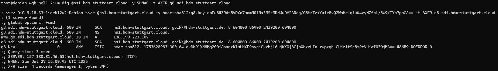

### Creating an 'A' record

Use the following command to add an A record, which maps a domain name to an IPv4-address:

```
nsupdate -y $HMAC
> server ns1.sdi.hdm-stuttgart.cloud
> update add www.g8.sdi.hdm-stuttgart.cloud 10 A <server-ip>
> send
> quit
```

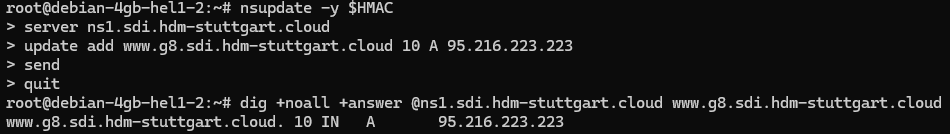

### Delete an 'A' record

Execute the command below to delete an A record:

```
$ nsupdate -y $HMAC
> server ns1.sdi.hdm-stuttgart.cloud
> update delete www.g8.sdi.hdm-stuttgart.cloud 10 A <server-ip>
> send
> quit
```

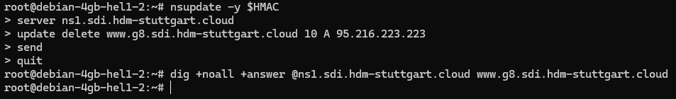

Since the record no longer exists, no response is returned.
Keep in mind that due to DNS caching, the deletion might not be visible globally until the time-to-live (TTL) defined in your SOA or the individual record expires. This delay can vary depending on those settings.

### Modify an 'A' record

To update an A record, you perform a combined action that deletes the existing record and creates a new one in one step:

```
nsupdate -y $HMAC
> server ns1.sdi.hdm-stuttgart.cloud
> update delete www.g8.sdi.hdm-stuttgart.cloud 10 A <server-ip>
> update add www.g8.sdi.hdm-stuttgart.cloud 10 A <server-ip>
> send
> quit
```

### How to secure Nginx

Before proceeding, make sure to set up A records for both www.gXY.sdi.hdm-stuttgart.cloud and gXY.sdi.hdm-stuttgart.cloud. These DNS records must point to the public IP-address of your server to ensure proper domain resolution.

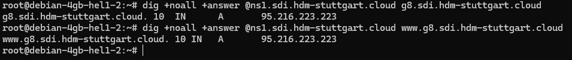

Install Certbot and the Nginx plugin on your server

```
sudo apt update
sudo apt install certbot python3-certbot-nginx
```

Certbot relies on your Nginx server block being correctly configured with the appropriate server_name directive in order to automatically install and apply the SSL certificate.
At this point, you can either use the default configuration file or, preferably, create a dedicated server block. For a cleaner and more organized setup, creating a separate server block is recommended.
[(Reference: How To Install Nginx on Debian 11)](https://www.digitalocean.com/community/tutorials/how-to-install-nginx-on-debian-11#step-5-setting-up-server-blocks-optional)

To begin, open your Nginx site configuration using a text editor like `nano`:

```
sudo nano /etc/nginx/sites-available/g8.sdi.hdm-stuttgart.cloud
```

Within the file, ensure that the `server_name` directive correctly reflects your domain and subdomain:

```
server_name g8.sdi.hdm-stuttgart.cloud www.g8.sdi.hdm-stuttgart.cloud;
```

After making any changes, save and exit the editor. Then, check the configuration syntax with:

```
sudo nginx -t
```

If the test is successful, apply the changes by reloading Nginx:

```
sudo systemctl reload nginx
```

Before requesting the SSL certificate, ensure that your server is permitted to receive HTTPS traffic. To do this, go to your server’s firewall settings and add a rule that allows TCP traffic on port 443 (HTTPS).

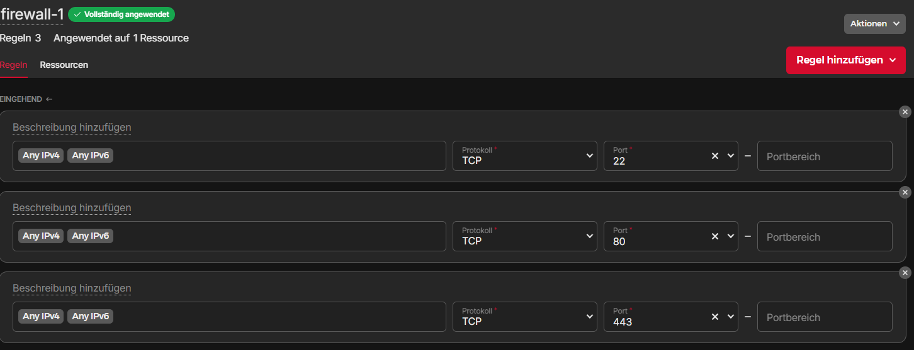

After that you’re ready to request your SSL certificate.
To prevent hitting `Let’s Encrypt’s` rate limits during testing, it’s recommended to use the staging environment first:

```
sudo certbot --staging --nginx -d g8.sdi.hdm-stuttgart.cloud
-d www.g8.sdi.hdm-stuttgart.cloud
```

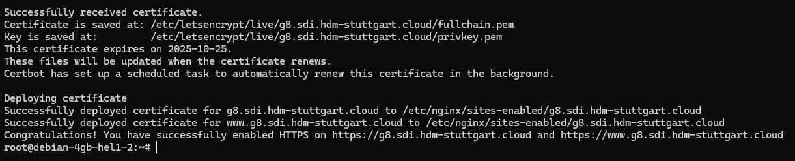

Certbot will prompt you to:

- Enter your email address
- Agree to the terms of service

If the test completes successfully, you can proceed with the real certificate:

```
sudo certbot --nginx -d g8.sdi.hdm-stuttgart.cloud
-d www.g8.sdi.hdm-stuttgart.cloud
```

Certbot will automatically:

- Validate that you own the domain
- Obtain the SSL certificate from Let’s Encrypt
- Configure Nginx to use HTTPS with the new certificate

Your site will then be accessible securely at:
`https://g8.sdi.hdm-stuttgart.cloud`

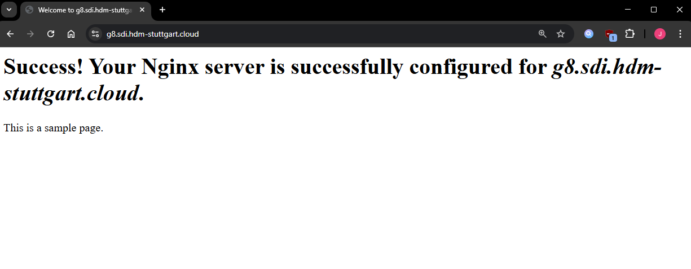

### Creating DNS A records with Terraform

#### Define Terraform provider

Start by defining the required provider in your terraform block. This configuration tells Terraform to use:

- The HashiCorp DNS provider (`dns`)

```
terraform {
  required_providers {
    hcloud = {
      source = "hetznercloud/hcloud"
    }
    dns = {
      source = "hashicorp/dns"
    }
  }
  required_version = ">= 0.13"
}
```

#### Configure the DNS provider

Next, you’ll configure the dns provider to connect to your DNS server (e.g., BIND). Provide the following:

- The DNS update server (server)
- TSIG key name (key_name)
- TSIG key algorithm (key_algorithm)
- The secret key (key_secret) read from a file

```
provider "dns" {
  update {
    server        = "ns1.sdi.hdm-stuttgart.cloud"
    key_name      = "g8.key."
    key_algorithm = "hmac-sha512"
    key_secret    = file("../dns_secret.key")
  }
}
```

Make sure the `dns_secret.key` file exists and contains the correct shared secret.

#### Create the main DNS record

Create an `A` record for your main server. You’ll need to provide:

- The zone (from the variable `dnsZone`)
- The name of the record (`serverName`)
- The IP-address (`serverIp`)
- A TTL (time to live) value

```
resource "dns_a_record_set" "workhorse" {
  zone      = "${var.dnsZone}."
  name      = var.serverName
  addresses = [var.serverIp]
  ttl       = 10
}
```

#### Create a root/empty DNS record

This creates an A record for the root domain (no subdomain name). It points to the same IP.

```
resource "dns_a_record_set" "empty" {
  zone      = "${var.dnsZone}."
  addresses = [var.serverIp]
  ttl       = 10
}
```

Note: This will apply if you want your domain (e.g., `example.com`) to resolve to the IP without a subdomain.

#### Create DNS aliases

If your server should be accessible via multiple names (aliases), use a `count` loop to create an A record for each alias. All of them will point to the same IP.

```
resource "dns_a_record_set" "aliases" {
  count     = length(distinct(var.serverAliases))
  zone      = "${var.dnsZone}."
  name      = var.serverAliases[count.index]
  addresses = [var.serverIp]
  ttl       = 10
}
```

Make sure the variable `serverAliases` is defined as a list of strings in your variables file or module input.

Run the following command to verify that everything is working correctly:

```
dig +noall +answer @ns1.hdm-stuttgart.cloud -y $HMAC -t AXFR gxy.sdi.hdm-stuttgart.cloud
```

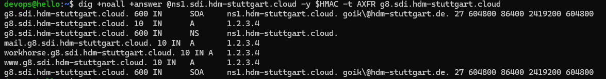

### Adjust resources for your server

Now that our server uses a proper DNS name we should update our `local_file` resources for our `ssh_script`, `scp_script` and `known_hosts` that we created for [Solving the known_hosts quirk](https://software-defined-infrastructure-ffbe0e.pages.mi.hdm-stuttgart.de/cloud-init.html#solving-the-known_hosts-quirk).

#### Update the SSH resource

```
resource "local_file" "ssh_script" {
  content = templatefile("tpl/ssh.sh", {
    devopsUsername = hcloud_ssh_key.loginUser.name
    ip = "${hcloud_server.helloServer.name}.${var.dnsZone}"
  })
  filename        = "bin/ssh"
  file_permission = "755"
  depends_on      = [local_file.known_hosts]
}
```

Once the server is running, Terraform generates the following file in the `bin` directory:
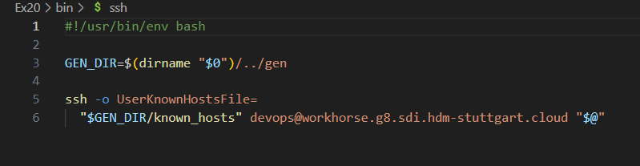

#### Update the SCP resource

```
resource "local_file" "scp_script" {
  content = templatefile("tpl/scp.sh", {
    devopsUsername = hcloud_ssh_key.loginUser.name
    ip = "${hcloud_server.helloServer.name}.${var.dnsZone}"
  })
  filename        = "bin/scp"
  file_permission = "755"
  depends_on      = [local_file.known_hosts]
}
```

Once the server is running, Terraform generates the following file in the `bin` directory:
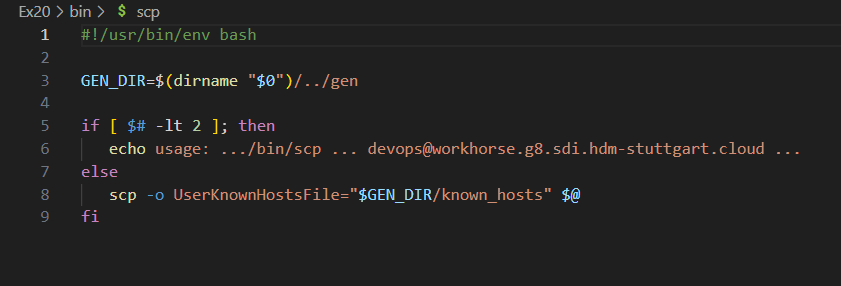

#### Update the known_hosts resource

```
resource "local_file" "known_hosts" {
  content         = "${hcloud_server.helloServer.name}.${var.dnsZone} ${tls_private_key.host.public_key_openssh}"
  filename        = "gen/known_hosts"
  file_permission = "644"
}
```
Once the server is running, Terraform generates the following file in the `gen` directory:
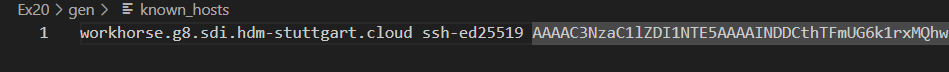

#### Update the dns_a_record_set resources

Previously in [Creating DNS A records with Terraform](https://software-defined-infrastructure-ffbe0e.pages.mi.hdm-stuttgart.de/dns.html#creating-dns-a-records-with-terraform), a placeholder IP-address that was provided by ourselves (`var.serverIP`), was used for all the A records that we created. To ensure that the domains resolve correctly, this placeholder should be replaced with the actual IPv4-address generated for the server when creating the A records.

```
resource "dns_a_record_set" "aliases" {
  count = length(distinct(var.serverAliases))
  zone  = "${var.dnsZone}."
  name  = var.serverAliases[count.index]
  addresses = [hcloud_server.helloServer.ipv4_address]
  ttl       = 10
}
```

You can test your changes with the following command:

```
dig +noall +answer @ns1.hdm-stuttgart.cloud -y $HMAC -t AXFR gxy.sdi.hdm-stuttgart.cloud
```

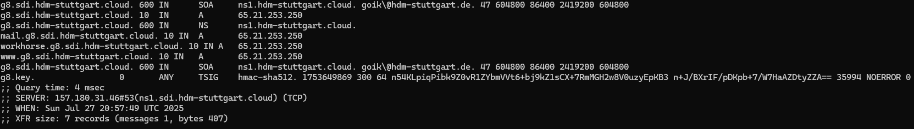
