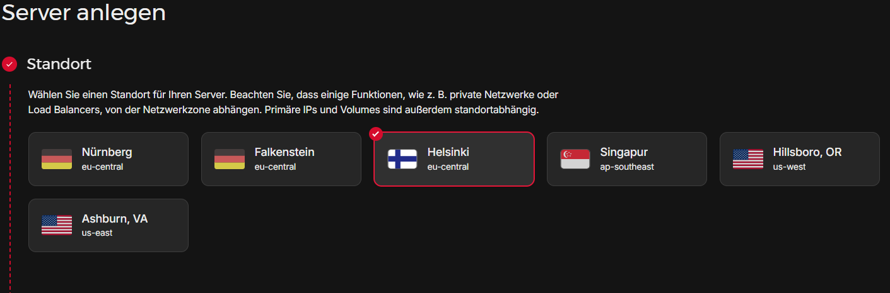
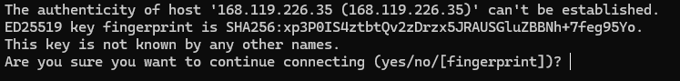
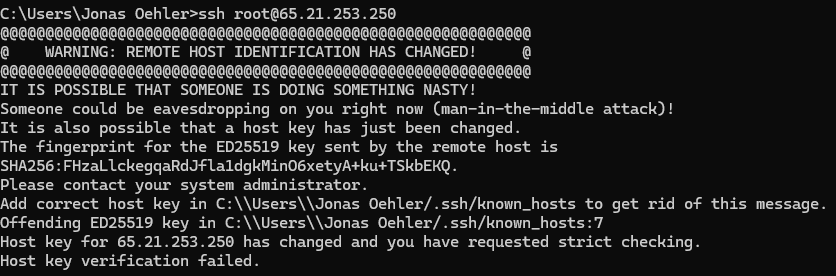
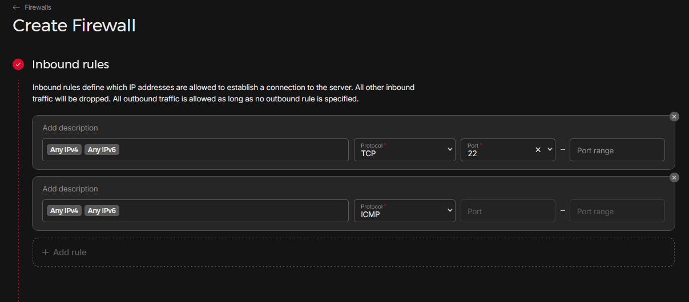
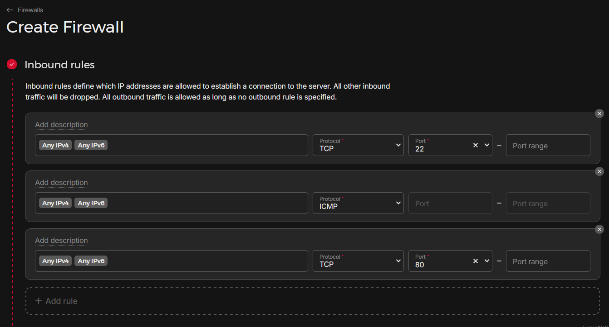
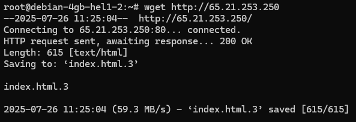
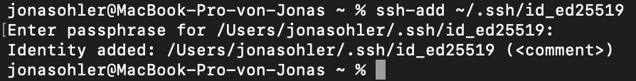
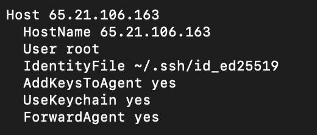
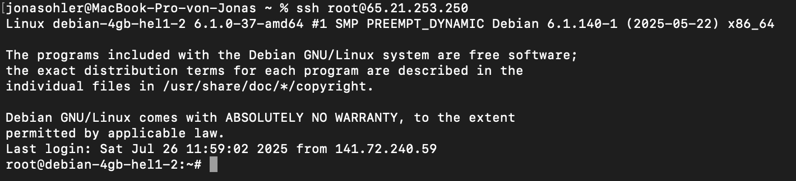

## What is Hetzner Cloud?

The Hetzner Cloud is a comprehensive platform designed for managing cloud infrastructure and resources efficiently. It allows users to deploy and control virtual servers, configure private networks, manage storage volumes, and handle various cloud services such as floating IPs, firewalls, and load balancers.

## Create a server

1.  Go to https://www.hetzner.com in your browser and log in via Login / Cloud button.
2.  Enter the project space assigned to your group.
3.  Click on the "Servers" tab and hit "Add Server".
4.  Configure your server settings:
    - Location: Choose "Helsinki". Image: Select the latest Debian.
    - Type: Select Shared VCPU / CX22 / x86 / Intel/AMD (or if that isn't available choose the next cheapest).
    - SSH Keys: Either skip for now or select any plubic ssh key that you have added before in the GUI.
    - Name: Provide a descriptive name of your choice for your server.
    - Leave all other options empty.
5.  Click "Create & Buy now".



### Access the server

You can access you knewly generated server via the Hetzner Console of your server but we will use ssh login via shell.

```
ssh root@<IP-address>
```

When connecting to a server via SSH for the first time, you will see a security prompt:



Since the host key is not yet known, SSH asks whether the connection is trustworthy. Type `yes` and press Enter. The key will then be saved locally, and the message will not appear in future connections.

If a server is deleted and then recreated, the following warning may appear if the same IP-address is assigned:



This message means the server's SSH host key has changed, but your local ~/.ssh/known_hosts file still contains the old key. For security reasons, SSH warns you of a potential attack (e.g., man-in-the-middle).
To resolve this manually, remove the outdated host entry. After that, the SSH connection will work again and the new key will be saved. Later, this problem will be circumvented.

### Secure your server

#### Create a SSH key pair

The first step to make your server more secure is to create a secure SSH key pair using the Ed25519 algorithm (recommended over RSA), run the following command on your local machine:

```
ssh-keygen -t ed25519
```

During the process, you’ll be prompted to:

- Choose a file location to save the key (default: `~/.ssh/id_ed25519`).
- Set a passphrase (optional, but adds an extra layer of security).

After completing these steps, two files will be generated:

- `id_ed25519` – your private key (keep this safe and never share it).
- `id_ed25519.pub` – your public key (this will be added to your server to allow access).

#### Upload the SSH key to Hetzner

1. Navigate to the Security section in the Hetzner Cloud Console.
2. Open the SSH Keys tab.
3. Click add SSH key and paste the contents of your public key file (id_ed25519.pub).

This allows Hetzner to provision new servers with your key, enabling passwordless SSH access.

#### Create a firewall

1. Go to the Firewalls section in the Hetzner Cloud GUI.
2. Create a new firewall that only allows inbound traffic for the default SSH and ICMP rules and any other ports that your applications use.



#### Update and reboot your server

Once you have access to the server, update all system packages by running:

```
apt update && apt upgrade -y
```

After the updates are complete, restart the server with:

```
reboot
```

#### Install nginx webserver

Install Nginx by running `apt install nginx`. To check if it’s running, use the command `systemctl status nginx`.

#### Test your firewall configuration

If you have installed any applications and properly configured their inbound rules, you should be able to access them via the assigned port. Because we have installed nginx before we will add port 80 to our inbound rules.



For example, if you have Nginx installed, you can check if it’s working by opening the server’s IP-address in the browser or using:

```
wget http://<IP-address>
```



#### Simplified SSH login

To simplify the login process, use an SSH agent. It lets you enter your passphrase only once per session instead of every time you connect.

Depending on your OS, the ssh-agent may start automatically at login or require manual configuration. However, regardless of the OS, you always need to explicitly add your SSH key to the agent.



Edit or create your SSH config file by adding following lines:



This ensures your key is automatically added and unlocked at login.

If everything is set up correctly, you won’t be prompted for your passphrase again.


