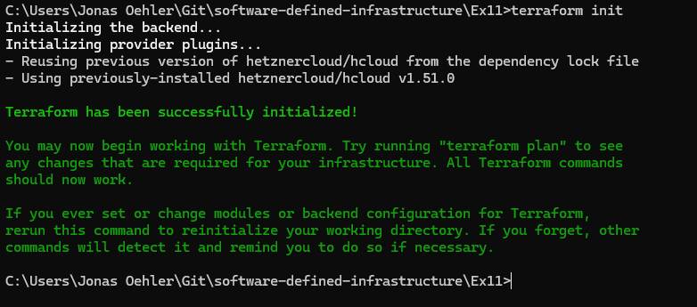
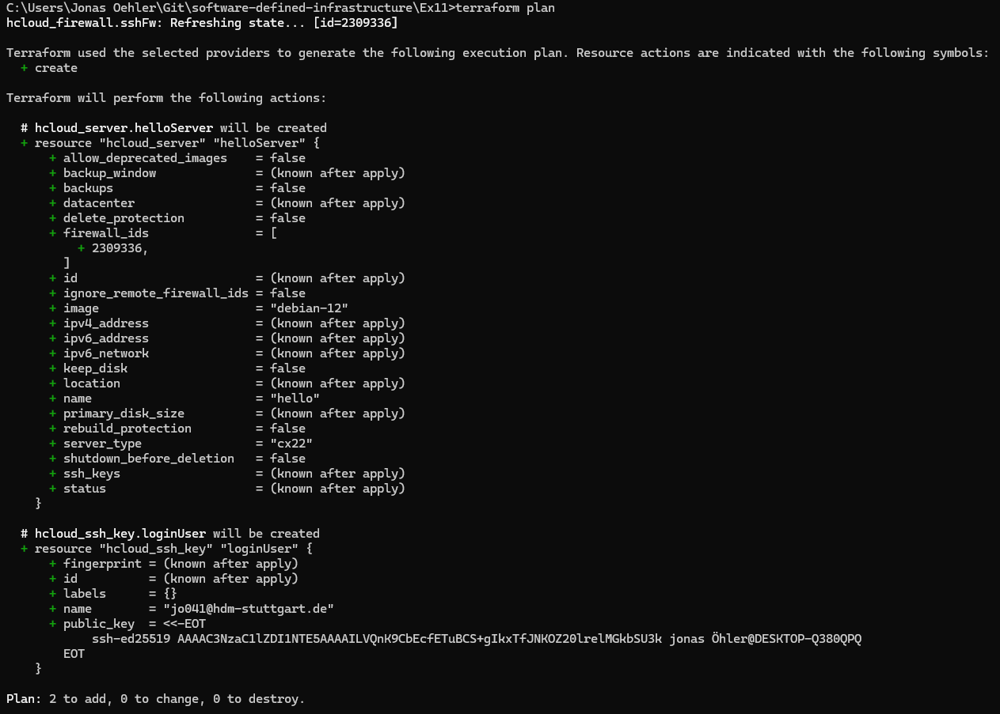
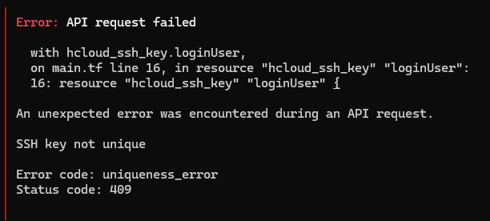
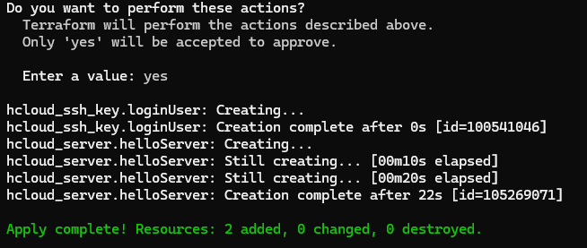
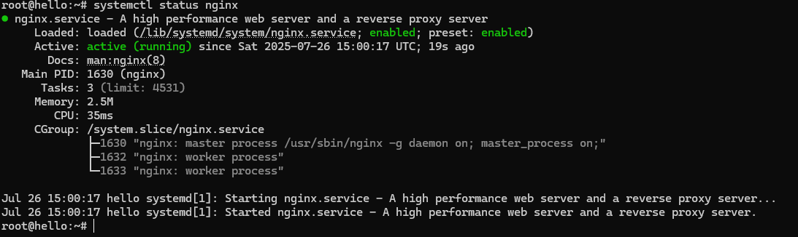

## What is Terraform?

HashiCorp Terraform is an infrastructure as code tool that lets you define both cloud and on-prem resources in
human-readable configuration files that you can version, reuse, and share. You can then use a consistent workflow to provision and manage all of your infrastructure throughout its lifecycle. Terraform can manage low-level components
like compute, storage, and networking resources, as well as high-level components like DNS entries and SaaS features. - [Terraform](https://developer.hashicorp.com/terraform/intro)

### Create a server with Terraform

#### Installing Terraform

- Download and install [Terraform](https://developer.hashicorp.com/terraform/install) 
- Once installed, verify it by running: `terraform -v`.

#### Accessing Hetzner Cloud API

- In the Hetzner Cloud web interface, navigate to: Security → API Tokens → Generate API Token.
- Assign a name to the token, generate it, and store it securely (e.g., in a password manager).
- **Important:** The token will not be shown again. If you lose it, you'll need to generate a new one.

#### Minimal Terraform configuration

Create a file named main.tf with the following content:

```
# Define Hetzner cloud provider
terraform {
  required_providers {
    hcloud = {
      source = "hetznercloud/hcloud"
    }
  }
  required_version = ">= 0.13"
}

# Configure the Hetzner Cloud API token
provider "hcloud" {
  token = var.api-key
}

# Create a server
resource "hcloud_server" "helloServer" {
  name         = "hello"
  image        =  "debian-12"
  server_type  =  "cx22"
}
```

This configuration defines Hetzner as the cloud provider, uses your API token for authentication, and provisions a server named "hello" with the Debian 12 image and the cx22 server type.

#### Terraform init

Before Terraform can manage your infrastructure, you need to initialize your working directory by running `terraform init`. This command installs the required provider plugins and sets up the environment for future Terraform operations.



#### Terraform plan

The `terraform plan` command allows you to preview the changes Terraform will apply to your infrastructure.



#### Terraform apply

To create the resources defined in your configuration, run: `terraform apply`. You’ll be prompted to confirm by typing `yes`. After confirmation, Terraform will proceed to create the resources and display the changes it makes.

#### Managing secrets & versioning

Put your configuration under version control (for example, using Git) to keep track of changes. However, this can risk exposing your API token. Since API tokens are sensitive, they should never be hardcoded or committed directly in your code.

A safer approach is to declare the token in a non-versioned, separate file (e.g. `providertoken.key`)
and reference it in your configuration.

```
provider "hcloud" {
 token = file("../providertoken.key")
}
```

#### Enabling SSH access

By default, the firewall may block SSH access to your server. To allow inbound SSH connections on port 22, you need to add a firewall rule. You can achieve this by defining a firewall resource in your `main.tf` file.

```
resource "hcloud_firewall" "sshFw" {
  name = "my-firewall"
  rule {
    direction = "in"
    protocol  = "tcp"
    port      = "22"
    source_ips = [
      "0.0.0.0/0",
      "::/0"
    ]
  }
```

Ensure the firewall is linked to your server resource.

```
# Create a server
resource "hcloud_server" "helloServer" {
  name         = "hello"
  image        =  "debian-12"
  server_type  =  "cx22"
  firewall_ids = [hcloud_firewall.sshFw.id]
}
```

To activate SSH key authentication, create an SSH key resource and associate it with the server:

```
resource "hcloud_ssh_key" "loginUser" {
  name       = var.loginUserName
  public_key = file("~/.ssh/id_ed25519.pub")
}

resource "hcloud_server" "helloServer" {
  name         = "hello"
  image        = "debian-12"
  server_type  = "cx22"
  firewall_ids = [hcloud_firewall.sshFw.id]
  ssh_keys     = [hcloud_ssh_key.loginUser.id]
}
```

You can now run `terraform apply` to implement your changes, which should enable SSH key access.
Be aware that there might be a conflicting SSH key manually added in the Hetzner GUI, as shown here:



If this happens, open the Hetzner GUI and remove the SSH key. Doing so should fix the error.



### Terraform user_data

If you want a script to run automatically when the server is created, this can be done, for example, by using a shell script.

Create a bash script (`user_data.sh`) that contains the necessary commands to install and configure Nginx:

```
#!/bin/bash
apt update
apt install -y nginx
systemctl start nginx
systemctl enable nginx
```

Define a server resource (`hcloud_server`) in your Terraform configuration that automatically runs this script during creation:

```
resource "hcloud_server" "helloServer" {
  name         = "hello"
  image        = "debian-12"
  server_type  = "cx22"
   user_data    = file("./userData.sh")
  firewall_ids = [hcloud_firewall.sshFw.id]
  ssh_keys     = [hcloud_ssh_key.loginUser.id]
}
```

You can verify that Nginx is running by opening the server’s IP-address in a web browser or by running `systemctl status nginx` on the server.


