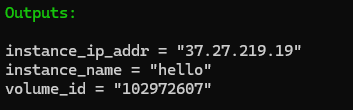
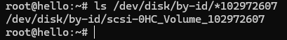
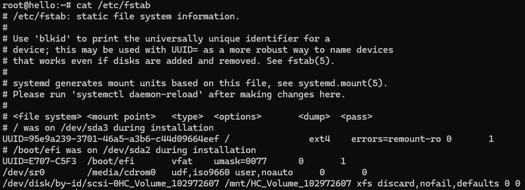
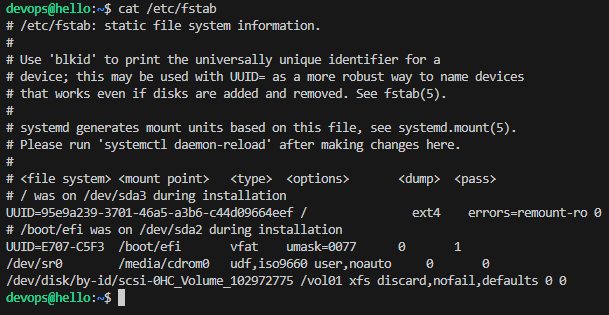

## Why should we use volumes?

Volumes offer persistent storage that can be connected to virtual machines.
When a server is deleted, its local storage is lost. However, by using a volume, you can store data permanently and simply attach it to another server when needed.

### Create a volume

#### Auto mount

To provision a volume using Terraform, you need to define an `hcloud_volume` resource.

```
resource "hcloud_volume" "volume01" {
  name      = "volume1"
  size      = 10
  server_id = hcloud_server.helloServer.id
  automount = true
  format    = "xfs"
}
```

You can retrieve the volume ID by adding an output block to the `outputs.tf` file:

```
output "volume_id" {
 value = hcloud_volume.volume01.id
 description = "The volume's id"
}
```

You will now see the volume ID when executing `terraform apply`.



You can find the name of the device associated with the volume by listing the files that correspond to the volume ID in the following directory:
`ls /dev/disk/by-id/*<volume-id>`



If you look at the `/etc/fstab` (file system table), you can see the volume listed in the last line.



#### Named mount

The current mount point is `/mnt/HC_Volume_102972607`, which was automatically generated. You may want to change this to a custom name, such as `vol01`. The desired entry in the `/etc/fstab` would then be:

```
/dev/disk/by-id/scsi-0HC_Volume_102135514 /vol01 xfs
discard,nofail,defaults 0 0
```

To change the entry, you need to edit the `/etc/fstab` file using Cloud-init (so within the userData.yml):

```
runcmd:
 ...
 - >
 echo `/bin/ls /dev/disk/by-id/*${volId}` /vol01 xfs
discard,nofail,defaults 0 0 >> /etc/fstab
 - systemctl daemon-reload
 - mount -a
```

This will update the `/etc/fstab` file, but you should also run `systemctl daemon-reload` and `mount -a` to apply your changes.

You also need to pass the `volId` into the `userData.yml`.
You can do that as follows:

```
resource "local_file" "user_data" {
  content         = templatefile("tpl/userData.yml", {
    host_ed25519_private = indent(4, tls_private_key.host.private_key_openssh)
    host_ed25519_public  = indent(4, tls_private_key.host.public_key_openssh)
    devopsUsername = hcloud_ssh_key.loginUser.name
    volId = hcloud_volume.vol01.id
  })
  filename        = "gen/userData.yml"
}

```

To avoid cyclic dependencies, make sure the server and the volume are in the same location (e.g., "nbg1").

```
resource "hcloud_volume" "vol01" {
 name      = var.volName
 size      = 10
 format    = "xfs"
 automount = false
 location = "nbg1"
}

resource "hcloud_server" "helloServer" {
  name         = "hello"
  image        = "debian-12"
  server_type  = "cx22"
  user_data    = local_file.user_data.content
  firewall_ids = [hcloud_firewall.sshFw.id]
  ssh_keys     = [hcloud_ssh_key.loginUser.id]
  location = "nbg1"
}
```

Now, attach the volume to the server by creating a `hcloud_volume_attachment` resource. This will link the previously created volume to your server

```
resource "hcloud_volume_attachment" "main" {
  volume_id=hcloud_volume.vol01.id
  server_id=hcloud_server.helloServer.id
  automount = false
}
```

When you inspect the `/etc/fstab` on your server, you will notice that the mount point now shows your custom name (e.g., `"vol01"`) in the last line.


